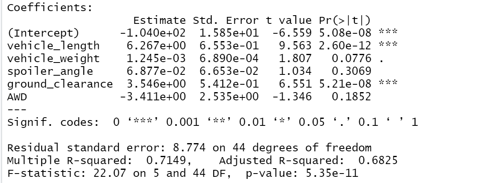
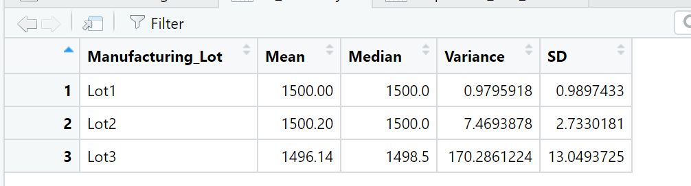
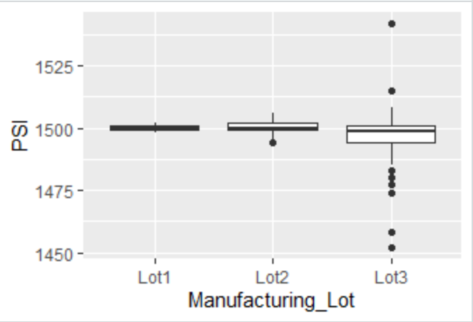
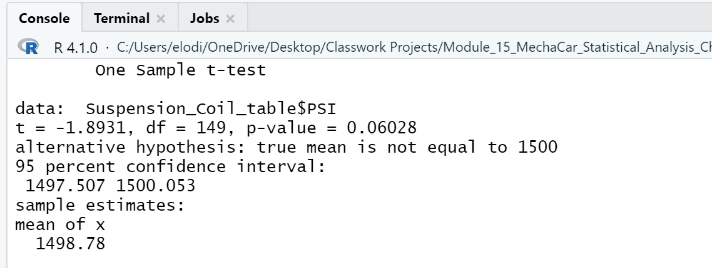
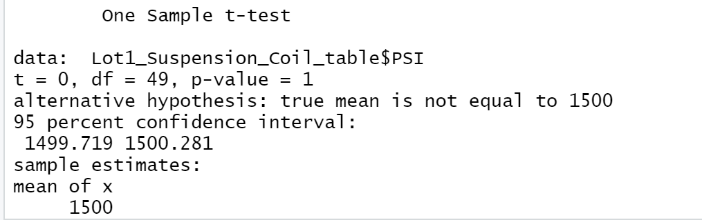
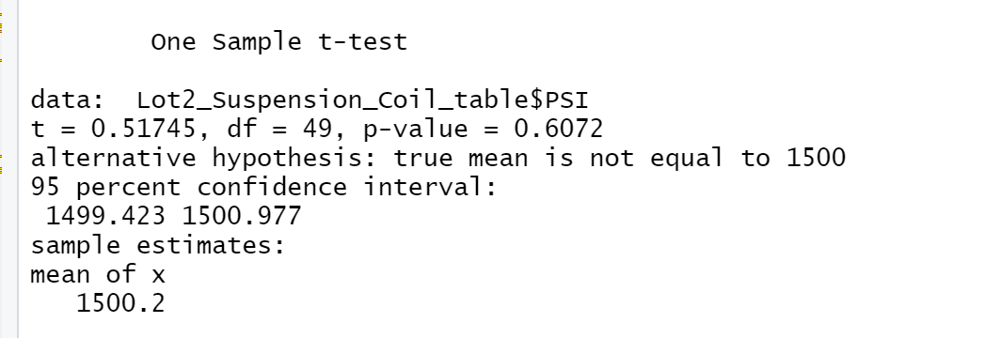
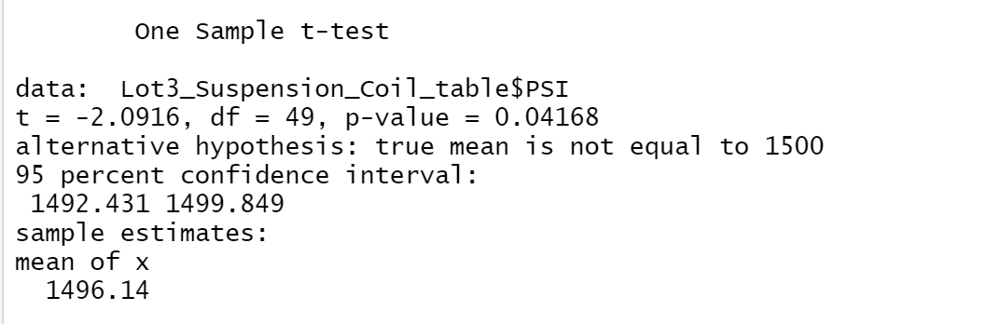

# Module_15_MechaCar_Statistical_Analysis

## **Linear Regression to Predict MPG**: 

### Which variables/coefficients provided a non-random amount of variance to the mpg values in the dataset?

#### In our summary, the Pr(>|t|) value represents the probablity that each coefficient contributes to a random amount of variance to the linear model. Based on the summary results, vehicle length and ground clearance, as well as intercept,  are statistically unlikely to provide random amounts of variance to the linear model, meaning that they have a significant impact on the MPG.

### Is the slope of the linear model considered to be zero? Why or why not?

#### The p-value in our linear regression is 5.35e-11, or 5.35*10^-11, which is much smaller that our assumed significance of 0.05%. Therefore, we can state that there is sufficient evidence to reject our null hypothesis, which means that the slope of our linear model is not zero.

### Does this linear model predict mpg of MechaCar prototypes effectively? Why or why not?

### The multiple r-squared value in our linear regression model is 0.7149, or 71%, while the p-values for both vehicle length and ground clearance remained significant. In other words, this multiple linear regression model is effective at predicting mpg of MechaCar prototypes.

## **Summary Statistics on Suspension Coils**:

### The design specifications for the MechaCar suspension coils dictate that the variance of the suspension coils must not exceed 100 pounds per square inch.

#### When looking at the whole manufacturing lots, the variance is 62 PSI, which is below their target of 100 PSI, meaning that as a whole, the manfucaturing lots mean their target design specification.

#### However, when we summarize the data by lot number, we calculated that the variance for  Lot 1 is 0.98 and Lot 2 is 7.47, both being below the 100 PSI target. Lot 3, on the other hand, is well above the target at 170 PSI. In conclusion, Lot 3 does not meet their target PSI design specification.

#### In the boxplot chart below, we can see that Lot 3's datapoints are a lot more spreadout that for Lots 1 and 2, with many outliers. 

## **T-Tests on Suspension Coils**:

### When we compared all manufacturing lots against the population of cars with 1,500 PSI, our calculated p-value was 0.06028, which is above the common 0.05 percent. Therefore, we do not have sufficient evidence to reject the null hypothesis, and conclude that both means are statistically similar.

### When we compared manufacturing lot 1 against the population of cars with 1,500 PSI, our calculated p-value was 1, which is above the common 0.05 percent. Therefore, we do not have sufficient evidence to reject the null hypothesis, and conclude that both means are statistically similar.

### When we compared manufacturing lot 2 against the population of cars with 1,500 PSI, our calculated p-value was 0.6072, which is above the common 0.05 percent. Therefore, we do not have sufficient evidence to reject the null hypothesis, and conclude that both means are statistically similar.

### When we compared manufacturing lot 3 against the population of cars with 1,500 PSI, our calculated p-value was 0.04168, which is below the common 0.05 percent. Therefore, we have sufficient evidence to reject the null hypothesis, and conclude that both means are not statistically similar.

